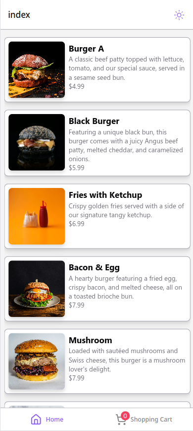
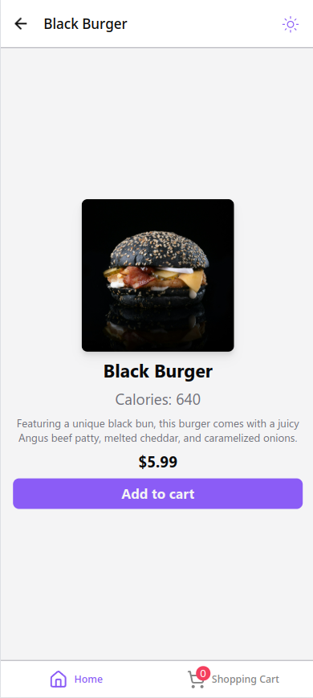
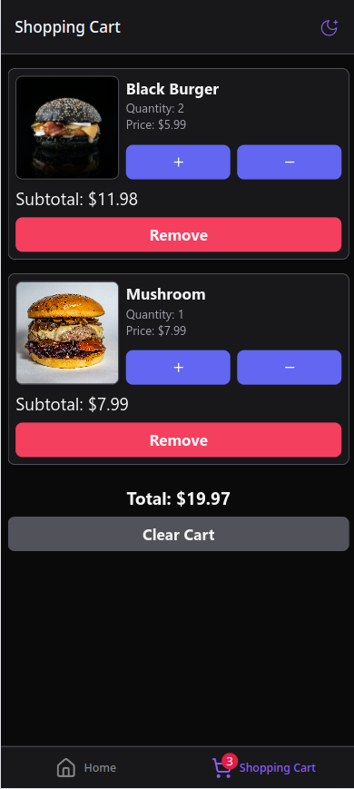

# Burgerhub Assignment

<div style="display: flex; gap: 8px">
   
   
   
</div>

## Tools and Technologies Used

### App

- [Expo 52](https://expo.dev/) - react native framework
- [React Native](https://reactnative.dev/) - ui rendering library
- [React Native Reusables](https://rnr-docs.vercel.app/getting-started/introduction/) - reusable components for react native inspired by shadcn
- [NativeWind](https://www.nativewind.dev/) - tailwindcss for react native
- [Zustand](https://zustand-demo.pmnd.rs/) - state management

### Testing

- [Jest](https://jestjs.io/) - javascript test framework
- [@testing-library/react-native](https://testing-library.com/docs/react-native-testing-library/intro/) - companion testing library for testing react and react native

## Get started

### Prerequisites

- Node.js and pnpm installed on your system

1. Install dependencies

```bash
pnpm install
```

2. Test the app

```bash
pnpm run test
```

3. Start the app

```bash
pnpm run start
```
